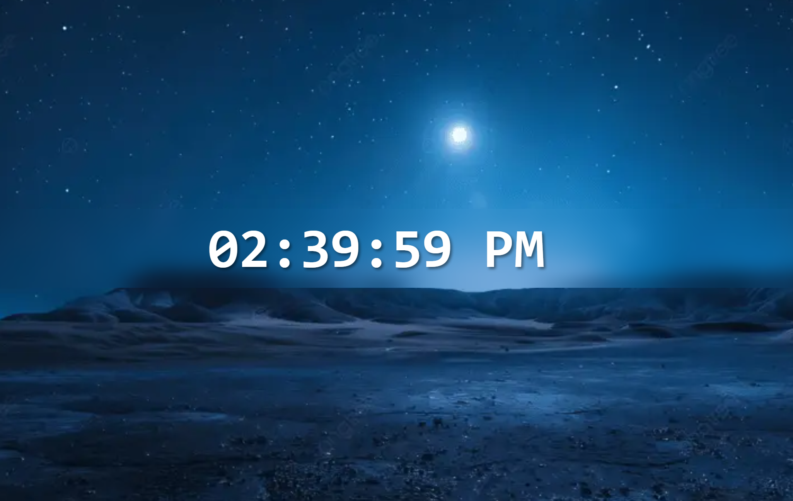

# React Digital Clock

A simple digital clock built with React using Vite. It updates every second using `useEffect` and displays the current time in 12-hour format with AM/PM.

## Features
- Live updating time (every second)
- 12-hour format with AM/PM
- Built with React hooks
- Minimal and clean UI

## Screenshot

